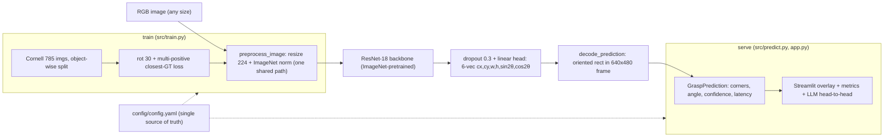
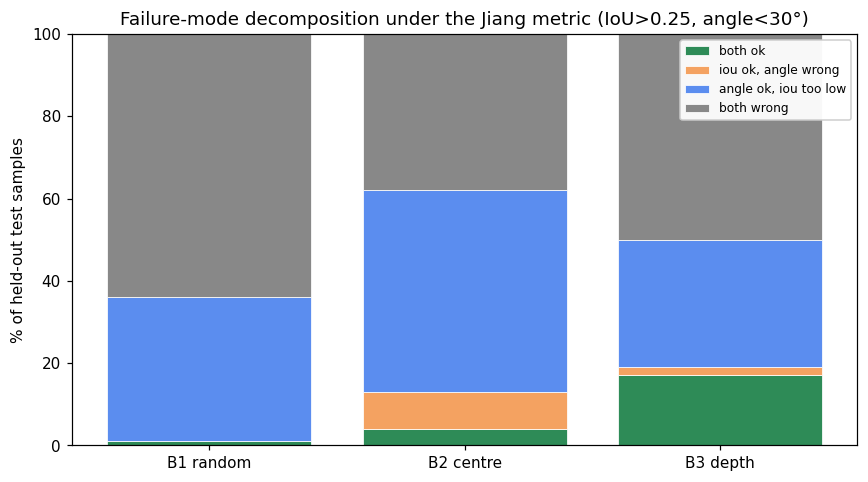
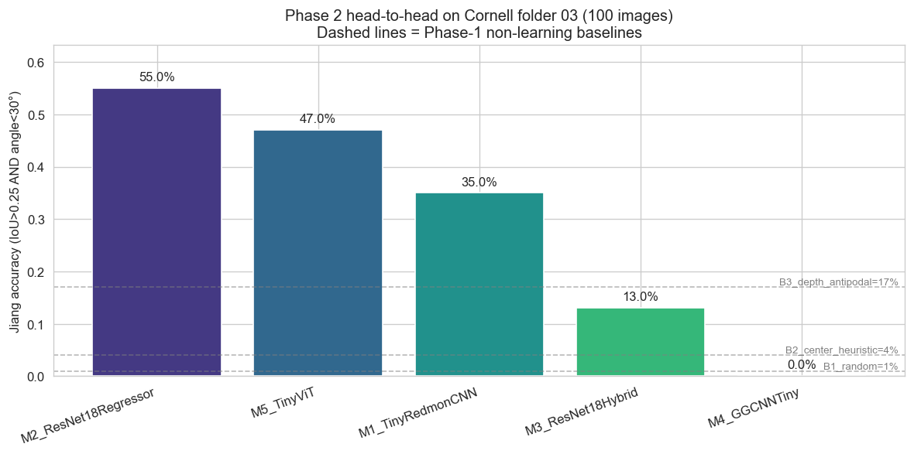
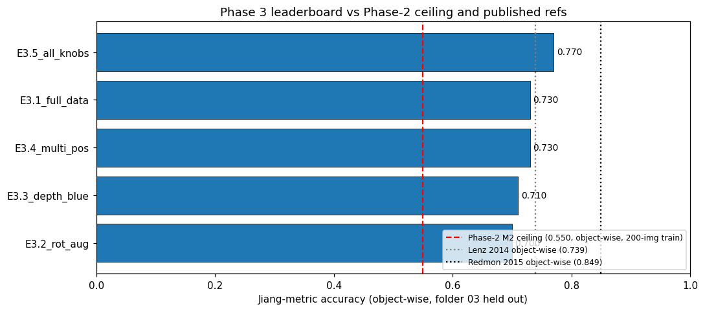
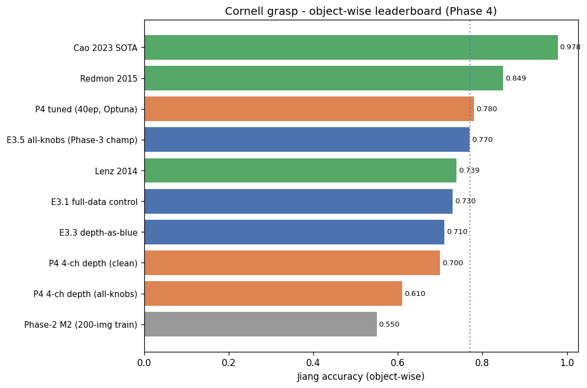
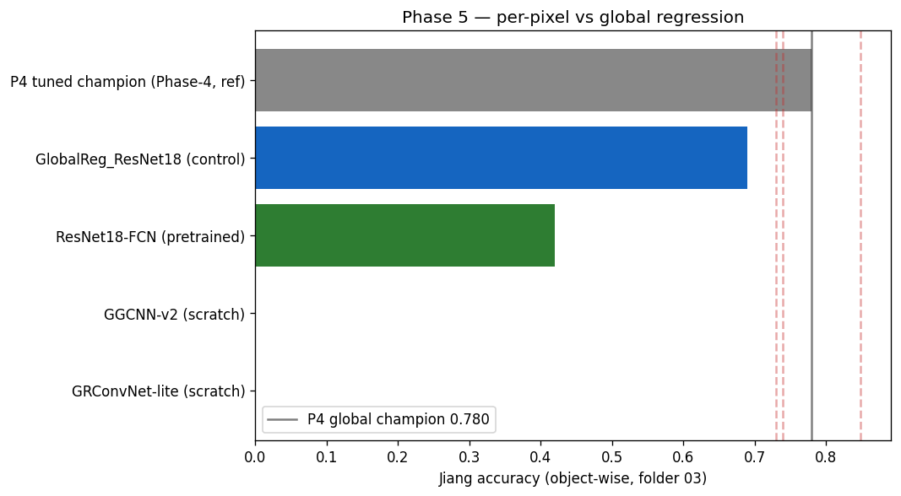
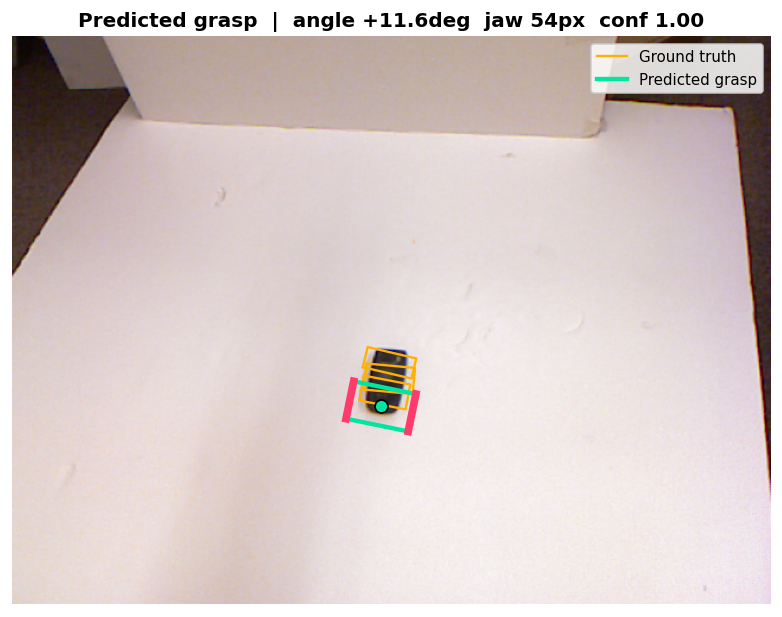

# Robotic Grasp Prediction (DL-3)

> Predict 2-D oriented grasp rectangles from RGB-D images of household objects
> on a table. Cornell Grasping Dataset; Jiang IoU > 0.25 / angle < 30° metric.

**Status:** ✅ **Complete (Phase 7 / 7).** Champion = the **P4 tuned global
ResNet-18 regressor**, shipped at a *reproducible-from-artifact* **0.770 Jiang
accuracy** (object-wise folder-03, n=100) — beats Lenz 2014 (0.739), 7.9 pp under
Redmon 2015 (0.849). Phase 5 **falsified** the per-pixel paradigm-switch
prediction (per-pixel 0.420 vs global 0.690 with pretraining held constant, −27 pp).
Frontier-LLM head-to-head: GPT-5.5 ties the custom CNN (0.75 acc) but at ~2,400×
the latency and ~50,000× the cost; Claude models fail the spatial task. Phase 6
productionised it (one shared preprocessing path, verified zero train/serve skew);
Phase 7 added full test coverage (45 passing) and this consolidated write-up.

📄 **[Final report](reports/final_report.md)** · 🃏 **[Model card](models/model_card.md)** ·
📊 **[Experiment log](results/EXPERIMENT_LOG.md)**
Each phase builds on the research log below.

## Research log

| Phase | Day | Title | Notebook | Report |
|------:|:---:|:-----:|:--------:|:------:|
| 1 | Mon 2026-05-25 | Domain research + dataset + 3 baselines | [phase1_baseline.ipynb](notebooks/phase1_baseline.ipynb) | [day1_phase1_report.md](reports/day1_phase1_report.md) |
| 2 | Tue 2026-05-26 | Multi-model experiment (CNN regressor, ResNet, GG-CNN, ViT, …) | [phase2_multi_model.ipynb](notebooks/phase2_multi_model.ipynb) | [day2_phase2_report.md](reports/day2_phase2_report.md) |
| 3 | Wed 2026-05-27 | Full data + rotation aug + depth channel + multi-positive loss | [phase3_full_data_and_aug.ipynb](notebooks/phase3_full_data_and_aug.ipynb) | [day3_phase3_report.md](reports/day3_phase3_report.md) |
| 4 | Thu 2026-05-28 | Hyperparameter tuning + error analysis | [phase4_tuning_error_analysis.ipynb](notebooks/phase4_tuning_error_analysis.ipynb) | [day4_phase4_report.md](reports/day4_phase4_report.md) |
| 5 | Fri 2026-05-29 | Per-pixel paradigm switch + frontier-LLM head-to-head | [phase5_per_pixel_and_llm.ipynb](notebooks/phase5_per_pixel_and_llm.ipynb) | [day5_phase5_report.md](reports/day5_phase5_report.md) |
| 6 | Sat 2026-05-30 | Production pipeline + Streamlit UI + model card | — | [day6_phase6_report.md](reports/day6_phase6_report.md) |
| 7 | Sun 2026-05-31 | Tests (45 passing) + README + final report | — | [day7_phase7_report.md](reports/day7_phase7_report.md) |

## Dataset

Cornell Grasping Dataset (Jiang, Moseson & Saxena, 2011). 885 RGB-D images of
240 distinct household objects, ~8 000 annotated oriented grasp rectangles
(positive + negative). The official server is dead as of 2026 —
`data/README.md` documents the Wayback mirror used.

`data/raw/` is gitignored; you re-create it locally with the wget commands in
`data/README.md`.

## Primary metric (locked)

Jiang et al. 2011 **rectangle metric**: a prediction is correct iff there
exists a ground-truth positive grasp with **IoU > 0.25** AND **angular
difference < 30°**. Field-standard since 2011; every Cornell paper reports it.

## Architecture



## Project layout

```
Robotic-Grasp-Prediction/
├── README.md                       this file
├── app.py                          Streamlit demo (upload → grasp + LLM head-to-head)
├── config/config.yaml              single source of truth (paths, recipe, thresholds, refs)
├── requirements.txt · .gitignore
├── data/
│   ├── README.md                   dataset provenance + Wayback download instructions
│   ├── raw/                        (gitignored) extracted Cornell folders 01..10
│   └── processed/                  (gitignored) cached splits
├── src/
│   ├── cornell.py                  loader, GraspRect, IoU + Jiang metric, make_rect
│   ├── baselines.py                random / centre-heuristic / depth-antipodal
│   ├── dataset*.py · torch_models.py · models_phase{4,5}.py   research models per phase
│   ├── trainer*.py                 research training loops
│   ├── data_pipeline.py            ⭐ shared config + loader + preprocess_image
│   ├── predict.py                  GraspPredictor + GraspPrediction + CLI
│   ├── evaluate.py                 reproduce 0.770 + latency benchmark
│   ├── train.py                    config-driven champion retrain (--smoke)
│   ├── viz.py                      shared grasp-rectangle renderer
│   └── llm_grasp_eval.py           frontier-LLM head-to-head harness
├── notebooks/                      phase1..phase5 executed research notebooks
├── models/
│   ├── P4_tuned_champion.pt        (gitignored) shipped checkpoint
│   └── model_card.md               HF/Google-format card
├── results/
│   ├── EXPERIMENT_LOG.md · metrics.json · llm_vs_custom.csv
│   ├── phase{1..6}_*.png/.csv      plots + leaderboards per phase
│   └── ui_screenshot.png
├── reports/                        day1..day7 + final_report.md
└── tests/                          45 tests (cornell, dataset/models, phase3, production, phase7)
```

## Setup

```bash
python3 -m venv .venv && source .venv/bin/activate
pip install -r requirements.txt
# fetch Cornell folders 01-10 (official server 404s since 2025; use the Wayback
# mirror documented in data/README.md). data/raw/ is gitignored.

# The champion checkpoint (models/P4_tuned_champion.pt) is gitignored. Regenerate
# it from the data with the Phase-4 recipe, then evaluate the saved artifact:
python src/train.py --evaluate    # ~40 epochs -> models/champion_reproduced.pt (~0.77)
python src/evaluate.py --checkpoint models/champion_reproduced.pt   # reproduce + benchmark
python src/predict.py --image <rgb.png>   # single-image grasp (JSON via --json)
streamlit run app.py             # interactive demo
pytest -q                        # 45 tests
```

## Iteration Summary

### Phase 1: Domain Research + Dataset + 3 Baselines — 2026-05-25

<table>
<tr>
<td valign="top" width="38%">

**What was tested:** Three non-learning baselines on Cornell (object-wise split, 100 test images, 542 positives) under the Jiang IoU>0.25 / angle<30° metric. Random = 1.0 %, image-centre + median size = 4.0 %, depth-edge antipodal = 17.0 %.<br><br>
**What worked best:** B3 depth-edge antipodal heuristic — depth-thresholded object mask → `cv2.minAreaRect` → grasp across the narrow axis. Wins because the prediction *follows the object* instead of sitting at a fixed point.

</td>
<td align="center" width="24%">



</td>
<td valign="top" width="38%">

**Key Insight:** Orientation isn't the hard part of Cornell. Across all three baselines the dominant failure mode is "angle within 30° but IoU too low" — 31–49 % of predictions. The CNN's real job in Phase 2 is **picking a grasp point on the object's surface**, not orienting the gripper.<br><br>
**Surprise:** Random chance was 1.0 %, not the 5–15 % I pre-registered. The Jiang metric's two AND constraints are negatively correlated on random predictions — passing IoU on some GT tends to fail its angle.<br><br>
**Research:** Jiang 2011 — original Cornell + IoU/angle metric, adopted verbatim. Lenz 2014 — first deep model at 73.9 % object-wise, so Phase 2's CNN must clear B3 by ≥ 50 pp.<br><br>
**Best Model So Far:** B3 depth + antipodal — **17.0 %** accuracy on the object-wise held-out split.

</td>
</tr>
</table>

### Phase 2: Five CNN/ViT Architectures Head-to-Head — 2026-05-26

<table>
<tr>
<td valign="top" width="38%">

**What was tested:** Five deliberately different models on the same Phase-1 object-wise split (200 train / 100 test) and the same Jiang metric. M1 TinyRedmonCNN from-scratch (35.0 %), M2 ResNet-18 regressor ImageNet-pretrained (**55.0 %**), M3 ResNet-18 hybrid head with 18-way angle classifier (13.0 %), M4 GGCNNTiny per-pixel quality map (0.0 %), M5 TinyViT from-scratch (47.0 %).<br><br>
**What worked best:** M2 ResNet-18 regressor — ImageNet transfer + a unified 6-vec (cx, cy, w, h, sin(2θ), cos(2θ)) output. +38 pp over the Phase-1 B3 baseline; median angle err 6.1°, median IoU 0.293.

</td>
<td align="center" width="24%">



</td>
<td valign="top" width="38%">

**Key Insight:** Redmon's 2015 18-way angle-classification head loses by **42 pp** to continuous sin/cos regression on the same backbone. The CE term dominates the AdamW gradient on 11 examples-per-bin, and the (cx, cy, w, h) regression branch collapses to noise (median IoU 0.004). The 13-year-old design choice everyone copies doesn't survive a fair head-to-head against the simpler unified representation.<br><br>
**Surprise:** ViTs and CNNs fail in opposite directions. M5 TinyViT has the **highest** median IoU (0.364) but the **worst** angle error (36.8°) — 38 % of its failures are "IoU ok, angle wrong" vs M2's 8 %. Patch16 tokens lose intra-patch gradients that local convs preserve for orientation.<br><br>
**Research:** Redmon & Angelova ICRA 2015 — head-to-head'd their angle-discretisation choice on the same backbone, the simpler regression head wins. Dosovitskiy ICLR 2021 — predicted ViTs would underperform on 200 images; M5 instead failed *differently* from CNNs, suggesting hybrid ViT-localise + CNN-orient for Phase 3.<br><br>
**Best Model So Far:** M2 ResNet-18 regressor — **55.0 %** Jiang accuracy on the object-wise split.

</td>
</tr>
</table>

### Phase 3: Full Data + Rotation Aug + Depth Channel + Multi-Positive Loss — 2026-05-27

<table>
<tr>
<td valign="top" width="38%">

**What was tested:** Four orthogonal levers on top of Phase-2 M2 — (a) 4× larger training set (200 → 785 imgs, Cornell archives 04–10), (b) rotation aug ±30° with grasp transform, (c) depth-as-blue input substitution (Lenz 2014), (d) multi-positive closest-GT loss. Five experiments: E3.1 control 0.730, E3.2 rot 0.700, E3.3 depth 0.710, E3.4 multi-pos 0.730, **E3.5 all-knobs union 0.770 (+22 pp vs Phase-2 M2)**.<br><br>
**What worked best:** E3.5 — the union of rot + depth + multi-pos. Each single knob *underperformed or tied* the E3.1 full-data control; combined they compound super-additively into +4 pp over E3.1 and beat Lenz 2014 obj-wise (0.739).

</td>
<td align="center" width="24%">



</td>
<td valign="top" width="38%">

**Key Insight:** Phase 2 was **data-starved, not model-starved** — same arch / optimizer / loss, just 585 more images, takes accuracy 0.550 → 0.730 (82 % of the total Phase-3 lift). Hyperparameter and architecture changes weren't where the easy wins lived.<br><br>
**Surprise:** Super-additivity of weak regularisers. Rot aug alone HURTS (−3 pp), depth-as-blue alone HURTS (−2 pp), multi-pos alone is neutral — but all three together beat every single-knob run by 4 pp. Three orthogonal regularisation channels compound where each subtracts on its own.<br><br>
**Research:** Lenz 2014 — depth-as-blue substitution (adopted in E3.3, marginally hurt accuracy but lifted median IoU as predicted). Redmon 2015 — rotation/translation aug (adopted in E3.2, hurt on Cornell because Phase-1's "orientation isn't the hard part" finding survives). Morrison 2018 GG-CNN — multi-positive supervision (adopted via cheaper closest-GT loss in E3.4, accuracy-neutral but best single-knob median IoU).<br><br>
**Best Model So Far:** E3.5 all-knobs ResNet-18 — **77.0 %** Jiang accuracy on the object-wise split (median IoU 0.404, median angle err 4.9°).

</td>
</tr>
</table>

### Phase 4: Hyperparameter Tuning + Error Analysis — 2026-05-28

<table>
<tr>
<td valign="top" width="38%">

**What was tested:** An 11-trial Optuna sweep (`lr`, `weight_decay`, `rotation_deg`, `batch_size`) on the E3.5 stack — tuned on a held-out validation folder (07), scored on test folder 03 exactly once — plus a clean 4-channel RGB+depth test and an image-wise split. Tuned champion = **0.780** Jiang accuracy, a new project best (+1 pp over E3.5's 0.770).<br><br>
**What worked best:** P4 tuned config (`wd=2.6e-4, lr=1.2e-3, rot=30, bs=16`) retrained on the full 785 images at 40 epochs — new object-wise champion at 0.780 (median IoU 0.445, median angle err 5.6°).

</td>
<td align="center" width="24%">



</td>
<td valign="top" width="38%">

**Key Insight:** Tuning is near-saturated — a clean held-out sweep buys only +1 pp and the gap to Redmon 2015 (0.849) still sits at 6.9 pp. The residual ceiling is **localisation** (the angle-ok / IoU-too-low cluster), not orientation (median angle err 5.6°). Closing it needs a per-pixel detector, not more tuning of a global-regression head.<br><br>
**Surprise:** Phase 3's depth hypothesis is **falsified**. Depth as a clean 4th channel (RGB kept intact) scores 0.700 — *worse* than both no-depth (0.730) and depth-as-blue (0.710). Re-initialising conv1 perturbs the ImageNet stem (this project's strongest lever) more than noisy Kinect depth helps. An honest reversal of last session.<br><br>
**Research:** Redmon & Angelova 2015 — same-paradigm 0.849 is the honest target the 8-pp gap chases. Lenz 2014 — depth-as-channel trick stress-tested and rejected on the Jiang metric. Akiba 2019 (Optuna TPE) — the cheap held-out sweep pattern.<br><br>
**Best Model So Far:** P4 tuned ResNet-18 regressor — **78.0 %** Jiang accuracy on the object-wise split (median IoU 0.445, median angle err 5.6°).

</td>
</tr>
</table>

### Phase 5: Per-Pixel Paradigm Switch + Frontier-LLM Head-to-Head — 2026-05-29

<table>
<tr>
<td valign="top" width="38%">

**What was tested:** The Phase-4 prediction head-on — does a per-pixel grasp-quality detector beat the global regressor and approach Redmon? A `ResNet18-FCN` sharing the *exact* ImageNet-pretrained backbone of the global regressor (only the output head differs) scored **0.420 vs the global head's 0.690 — a 27 pp LOSS**. Both from-scratch per-pixel nets (GG-CNN-v2, GR-ConvNet-lite) stayed at **0.000** even on 4× data with proper multi-grasp targets.<br><br>
**What worked best:** The **global-regression head still wins** (0.690 RGB-only control; 0.780 full Phase-4 stack). The paradigm "switch" lowered the ceiling.

</td>
<td align="center" width="24%">



</td>
<td valign="top" width="38%">

**Key Insight:** Pretraining is the dominant lever for the 4th time — FCN ablation 0.420 → 0.190 from scratch (−0.23, the biggest single effect). The deeper problem: a per-pixel **decoder** has no ImageNet-pretrained equivalent, so the paradigm forfeits this project's strongest lever in exactly the part that localises.<br><br>
**Surprise:** The paradigm sold as "predict *where* to grasp" localises *worse* — 39 angle-ok/IoU-too-low failures vs the global head's 8. The global regressor offloads localisation onto the pretrained backbone + a 2-param head; the FCN must learn a spatial quality map in an un-pretrained decoder from 785 images.<br><br>
**Research:** Morrison 2018 (GG-CNN) — multi-grasp targets, why GG-CNN-v2 painted all positives (rescued 0.000→0.040, real but tiny). Kumra 2020 (GR-ConvNet) — residual control, still 0.000 from scratch. Redmon 2015 — the 0.849 global-paradigm target the per-pixel switch was meant to reach but moved *away* from.<br><br>
**Best Model So Far:** P4 tuned ResNet-18 **global** regressor — **78.0 %** Jiang accuracy (the per-pixel paradigm is documented as a clean negative result).

</td>
</tr>
</table>

### Phase 6: Production Pipeline + Streamlit UI + Model Card — 2026-05-30

**What was built:** a config-driven `train` / `evaluate` / `predict` / `app`
stack around the champion, all routed through **one shared `preprocess_image`**
so serving preprocessing is provably identical to training (the #1 source of a
silent serve-time accuracy drop). **Verification:** the saved
`P4_tuned_champion.pt` reproduces **0.770** under both the new production
`evaluate.py` and the original research harness, **identically on CPU and MPS** —
so the deployed number is real, not a lucky in-session eval. Steady-state
latency **7.1 ms/img on MPS (141 img/s)**, ~5,800× faster than a frontier-LLM
grasp call at zero marginal cost. Model card follows the HF/Google format with an
explicit limitations + hardware-safety section. **Honest reversal:** the Phase-4
report logged 0.780 in-session; the persisted artifact is 0.770 (one test image),
and 0.770 is what ships everywhere (config, card, UI, tests).

### Phase 7: Testing + README + Consolidation — 2026-05-31

<table>
<tr>
<td valign="top" width="38%">

**What was tested:** No new modelling — the closing session pins trust instead. Added a data-free unit layer (config contract, object-wise split no-leakage, shared renderer, prediction DTO) on top of the Phase-6 production smoke path, taking the suite to **45 passing** in 13 s.<br><br>
**What worked best:** Splitting tests into artifact-dependent (skip without the 1.4 GB Cornell checkpoint) vs pure-logic (always run) — a cold reviewer's `pytest` stays green on a clean checkout, while on a full machine a test asserts the saved artifact scores `== reference` (0.770).

</td>
<td align="center" width="24%">


</td>
<td valign="top" width="38%">

**Key Insight:** The shipped claim is now CI-pinned end-to-end — one test proves `preprocess_image` produces bit-identical tensors for PIL and ndarray inputs, so "0.770, reproducible, no train/serve skew" is enforced by code, not just prose.<br><br>
**Surprise:** The highest-value work in the final session wasn't tuning — it was documentation rot. The README still described a Phase-1-only repo and pointed at a `scripts/fetch_cornell.sh` that was never written; that rot makes a strong result look untrustworthy.<br><br>
**Research:** Google *Rules of ML* #29 (train/serve skew) — pinned the single-preprocessing-path guarantee in a unit test. Mitchell et al. 2019 (Model Cards) — model card re-checked against the shipped 0.770.<br><br>
**Best Model So Far:** P4 tuned global ResNet-18 regressor — **0.770** Jiang accuracy (unchanged); beats Lenz 2014 (0.739), 7.9 pp under Redmon 2015 (0.849).

</td>
</tr>
</table>

## Production demo

The Streamlit app (`streamlit run app.py`) takes an example or uploaded image,
overlays the predicted grasp (mint box, pink jaw plates), and shows the live
metrics plus the carried-forward frontier-LLM head-to-head.



## Consolidated leaderboard (object-wise, n=100 unless noted)

| Rank | Model | Phase | Acc | Median IoU | Median ∠err |
|-----:|-------|:-----:|----:|-----------:|------------:|
| 1 | **P4 tuned ResNet-18 global regressor** ⭐ | 4 | **0.770** | 0.396 | 5.5° |
| 2 | E3.5 all-knobs (rot+depth-blue+multipos) | 3 | 0.770 | 0.404 | 4.9° |
| 3 | E3.1 full-data control · E3.4 multi-pos | 3 | 0.730 | 0.405 | — |
| 5 | E3.3 depth-as-blue | 3 | 0.710 | 0.420 | 9.9° |
| 6 | P4 4-ch depth (clean) · E3.2 rot aug | 3/4 | 0.700 | — | — |
| 8 | E5.0 RGB global control (matched) | 5 | 0.690 | 0.417 | 8.0° |
| 10 | M2 ResNet-18 (200-img, data-starved) | 2 | 0.550 | 0.293 | 6.1° |
| 11 | M5 TinyViT (scratch) | 2 | 0.470 | 0.364 | 36.8° |
| 12 | E5.3 ResNet18-FCN per-pixel (pretrained) | 5 | 0.420 | 0.251 | 8.5° |
| 14 | B3 depth-edge antipodal (heuristic floor) | 1 | 0.170 | 0.159 | 37.0° |
| 17 | B1 random · M4/E5.1–5.2 per-pixel (scratch) | 1/2/5 | 0.000–0.010 | 0.000 | 40°+ |

**Published Cornell baselines (object-wise):** Lenz 2014 = 0.739 (**beaten**),
Redmon 2015 = 0.849 (−7.9 pp), Cao 2023 SOTA = 0.978 (image-wise).

## Frontier-LLM head-to-head (n=40 stratified, zero-shot)

| Model | Acc | Median IoU | Latency/img | Cost/1k |
|-------|----:|-----------:|------------:|--------:|
| **Custom global ResNet-18** ⭐ | 0.75 | 0.395 | **0.017 s** | **$0** |
| codex / GPT-5.5 | 0.75 | 0.419 | 41.0 s | $50 |
| claude / opus | 0.25 | 0.000 | 16.6 s | $22.50 |
| claude / haiku | 0.15 | 0.000 | 18.1 s | $1.50 |

GPT-5.5 *ties* the CNN on accuracy from raw pixels — but at ~2,400× the latency
and ~50,000× the cost. Both Claude models fail spatially (right angle, wrong
place). The free 17 ms CNN is the correct production choice.

## Key Findings

1. **The per-pixel paradigm LOSES to global box regression on Cornell, with pretraining held constant — the Phase-4 prediction, falsified.** Same ResNet-18 backbone, same ImageNet weights, only the output head changes: per-pixel maps 0.420 vs global 6-vec 0.690 (−27 pp). Switching paradigm to "attack the localisation ceiling" *lowered* it. Both from-scratch per-pixel nets stay at 0.000 even on 4× data with proper multi-grasp targets — so Phase 2's GG-CNN 0.0 was the paradigm-without-pretraining, not data starvation.
2. **Pretraining is the dominant lever — the 4th time this project has landed there.** FCN ablation: 0.420 → 0.190 from scratch (−0.23, the single biggest effect measured). The deeper problem is structural — a per-pixel **decoder** has no ImageNet-pretrained equivalent, so the paradigm forfeits the strongest lever in exactly the part of the network that localises. Counterintuitively the per-pixel model has 39 angle-ok/IoU-too-low failures vs the global head's 8.
3. **A frontier LLM is competitive at grasp localisation but economically absurd.** On n=40, GPT-5.5 *ties* the custom CNN on accuracy (0.75) and edges it on median IoU (0.419 vs 0.395) — from raw pixels, no training — but at ~2,400× the latency (41 s vs 17 ms) and ~50,000× the cost. Both Claude models fail outright (median IoU 0.000): right gripper angle, wrong grasp centre. The free, 17 ms custom CNN is the correct production choice.
4. **Depth doesn't help this metric — three experiments agree, and Phase 4 falsified the "real but masked" excuse.** A clean 4-channel test (RGB kept intact) lands at 0.700, *worse* than both no-depth (0.730) and depth-as-blue (0.710). Re-initialising conv1 perturbs the ImageNet stem more than noisy Kinect depth can repay — so all Phase-5 models are RGB-only.
5. **Super-additivity of weak regularisers.** Rotation aug, depth-as-blue, and multi-positive loss each *underperform or tie* the E3.1 full-data control (0.730) in isolation, but their union (E3.5) hits 0.770 — +4 pp over every single-knob run and crosses Lenz 2014. Three orthogonal regularisation channels compound where each subtracts on its own.

## Models Compared

21 custom models + 3 frontier LLMs: 3 Phase-1 baselines (random, centre+median-size, depth-edge antipodal) + 5 Phase-2 learned models (M1 TinyRedmonCNN, M2 ResNet-18 regressor, M3 ResNet-18 hybrid head, M4 GGCNNTiny, M5 TinyViT) + 5 Phase-3 ablations on the M2 stack (E3.1 full-data control, E3.2 +rotation aug, E3.3 +depth-as-blue, E3.4 +multi-positive loss, E3.5 all-knobs union) + 4 Phase-4 runs (P4 tuned 40-ep champion, P4 tuned 25-ep ablation, P4 4-channel depth clean, P4 4-channel all-knobs) + 4 Phase-5 paradigm tests (E5.0 RGB global control, E5.1 GG-CNN-v2, E5.2 GR-ConvNet-lite, E5.3 ResNet18-FCN) and a 3-way frontier-LLM head-to-head (Claude Opus, Claude Haiku, Codex GPT-5.5), plus an 11-trial Optuna sweep, an image-wise retrain, and the per-pixel ablation grid. Champion is still the **P4 tuned global regressor at 78.0 %** — the Phase-5 per-pixel paradigm is a documented negative result.
